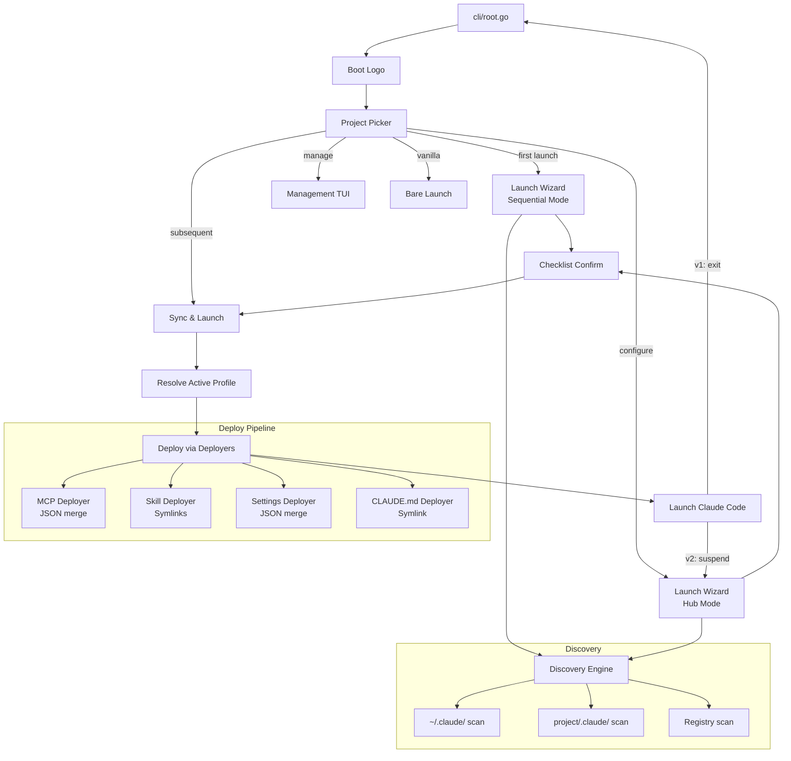
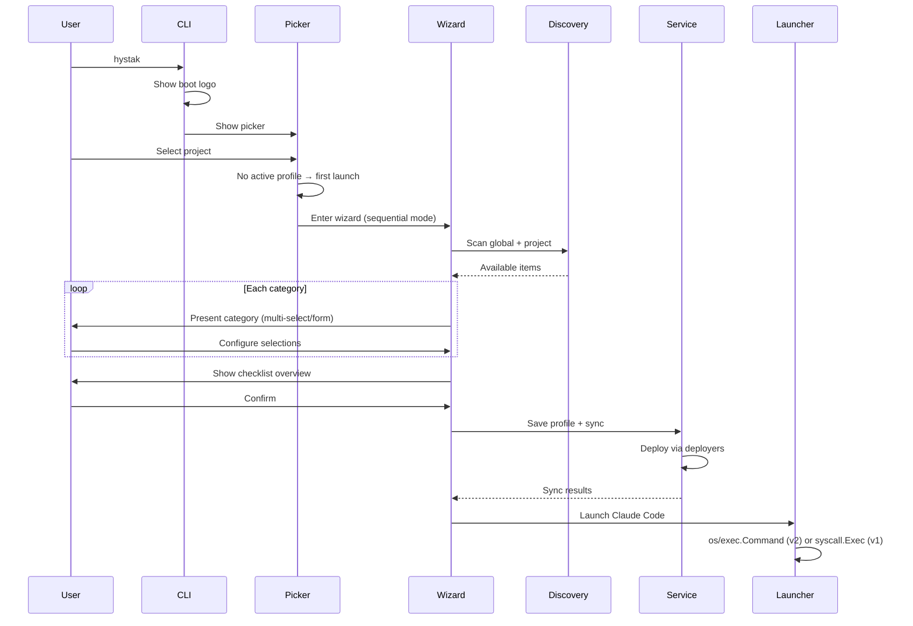
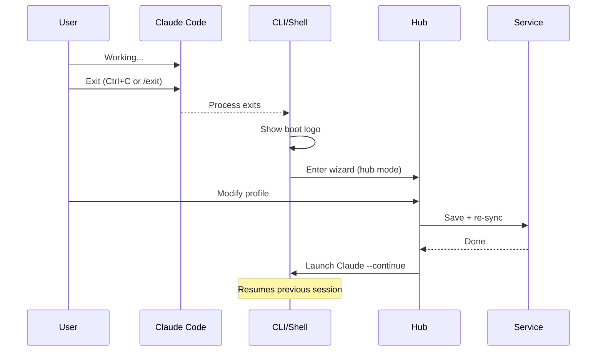

# Launch Wizard — Design Document

## Overview

The Launch Wizard transforms hystak from a configuration management tool into a complete Claude Code session launcher. When a user runs hystak, they see a branded boot screen, pick a project, configure their tooling loadout through a guided wizard, and launch Claude Code — all from a single flow. The wizard is the single pane of glass for configuring every aspect of a Claude Code project: MCPs, skills, permissions, hooks, CLAUDE.md, environment variables, and plugins.

The core philosophy is **configure once, use many times**. Users curate named profiles — subsets of available tools — and switch between them instantly. hystak discovers everything available on the system, and the wizard lets you pick only what you need, reducing Claude Code context bloat.

### Key Capabilities

- **First-launch wizard**: Sequential guided setup on first project launch
- **On-demand reconfiguration**: Hub-style access for returning users
- **Profiles**: Named loadouts (global + project-scoped), shareable as YAML
- **Filesystem discovery**: Scan `~/.claude/` and project directories to find available MCPs, skills, hooks, permissions
- **Symlink-based deploys**: Managed configs deployed as symlinks, trivial to identify and clean up
- **Configurable isolation**: None, worktree, or lock — supporting concurrent sessions and agent teams
- **Boot logo**: ASCII art hystak banner on startup

---

## Detailed Requirements

### R1: Wizard Trigger

- **First launch**: Show wizard when a project has never been launched (no active profile exists).
- **On demand**: Available via picker menu option, CLI flag (`--configure`), or keyboard shortcut within the management TUI.
- **Subsequent launches**: Skip wizard, go directly to sync → launch with the active profile.

### R2: Configuration Categories

The wizard covers every Claude Code configuration surface:

| Category | Source | Wizard UI | Deploy Target |
|----------|--------|-----------|---------------|
| MCP Servers | Registry + `~/.claude.json` + `.mcp.json` | Multi-select list with toggle | `.mcp.json` (JSON merge) |
| Skills | `~/.claude/skills/` + project `.claude/skills/` | Multi-select list with toggle | `.claude/skills/<name>/SKILL.md` (symlink) |
| Permissions | Discovery from enabled MCPs + free-text | Multi-select + text input | `.claude/settings.local.json` |
| Hooks | `~/.claude/settings.json` + project settings | Form-based (event + matcher + command) | `.claude/settings.local.json` |
| CLAUDE.md | Templates in registry + existing files | `$EDITOR` with preview | `CLAUDE.md` (symlink) |
| Environment Variables | Settings files + manual entry | Key=value table editor | `.claude/settings.local.json` |
| Plugins | Discovery from Claude Code config | Multi-select list with toggle | Appropriate config file |

### R3: Mid-Session Reconfiguration

**v1 (Sequential)**: User exits Claude Code, hystak detects exit, offers reconfiguration before relaunch. Claude Code supports `--continue` for session resumption.

**v2 (Job Control)**: hystak keeps parent process alive, suspends Claude via SIGTSTP, shows wizard TUI, re-syncs, resumes Claude via SIGCONT. Requires architectural change from `syscall.Exec()` to `os/exec.Command()`.

### R4: Wizard UI Structure

**First launch (sequential + hub + checklist)**:
1. Boot logo (ASCII art)
2. Project picker
3. Sequential walk-through of each category (skippable)
4. Each step is a hub — navigate freely within the category
5. Checklist overview of everything configured
6. Confirm & launch

**On-demand reconfiguration (hub + checklist)**:
1. Jump directly to hub (tab/menu of categories)
2. Edit any category
3. Checklist overview
4. Confirm & re-sync (then relaunch if v2)

### R5: Profiles

- **Global profiles**: Stored in `~/.hystak/profiles/`, reusable across projects
- **Project profiles**: Stored in project config, can extend/override a global profile
- **Shareable**: Exportable as YAML, importable by teammates
- **Built-in vanilla profile**: Empty profile that deploys nothing (removes all managed configs)
- **Active profile tracking**: Each project tracks which profile was last used

### R6: Config Ownership Model

```
~/.hystak/                          ← hystak source of truth (owns entirely)
├── registry.yaml                   ← all known MCPs, skills, hooks, etc.
├── profiles/                       ← global named loadouts
│   ├── frontend.yaml
│   └── backend.yaml
└── projects/
    └── myproject.yaml              ← project config + profiles + active profile

~/.claude/                          ← READ-ONLY discovery source (never modified)

project/.mcp.json                   ← deploy target (managed entries in JSON)
project/.claude/skills/             ← deploy target (symlinks to ~/.hystak/)
project/.claude/settings.local.json ← deploy target (managed keys in JSON)
project/CLAUDE.md                   ← deploy target (symlink to ~/.hystak/)
```

### R7: Symlink Deploy Strategy

- **Skills**: `project/.claude/skills/<name>/SKILL.md` → `~/.hystak/skills/<name>/SKILL.md`
- **CLAUDE.md**: `project/CLAUDE.md` → `~/.hystak/templates/<name>.md`
- **`.mcp.json`**: Cannot symlink (single JSON file with managed + unmanaged entries). Managed entries tracked via `~/.hystak/projects/<name>.yaml` metadata.
- **`settings.local.json`**: Cannot symlink (single JSON file). Managed keys tracked via metadata.
- **Identifying managed items**: Symlink = managed by hystak. Regular file = user-owned.

### R8: Concurrency & Isolation

User-configurable per project or per launch:

| Strategy | Behavior | Use Case |
|----------|----------|----------|
| **none** (default) | Deploy to project root. One session at a time. | Solo work |
| **worktree** | Each launch gets a git worktree with isolated configs. | Agent teams, concurrent profiles |
| **lock** | Deploy to project root, prevent concurrent launches. | Safety-first solo work |

Configurable via:
- Project-level default in `~/.hystak/projects/<name>.yaml`
- Launch flag: `hystak run myproject --worktree`
- Wizard prompt during first-time setup

### R9: Discovery

Scan both global and project scope to find available items:

**Global discovery** (read-only):
- `~/.claude.json` → extract `mcpServers`
- `~/.claude/settings.json` → extract hooks, permissions, env vars
- `~/.claude/skills/*/SKILL.md` → available skills

**Project discovery** (read-only before first deploy):
- `.mcp.json` → existing MCP servers
- `.claude/settings.local.json` → existing hooks, permissions
- `.claude/skills/*/SKILL.md` → project skills

**Permission discovery**:
- Scan enabled MCPs for available tools (from MCP tool manifests if accessible)
- Allow free-text additions for tools not yet discovered

### R10: Unmanaged Config Handling

- Show unmanaged items tagged as "unmanaged" in the wizard
- Offer an "adopt" action to bring them under hystak management
- Never modify or delete unmanaged items during sync

### R11: Boot Logo

ASCII art of "hystak" displayed on startup, before the picker. Simple stylized text, no version or metadata.

### R12: Merged TUI

The wizard is not a separate application — it's a mode within the existing management TUI. The TUI gains a "launch wizard" flow that reuses existing tab models (MCPs, Skills, Hooks, Permissions) and form overlays. `hystak manage` opens the full TUI; the wizard provides a launch-oriented entry point into the same interface.

---

## Architecture Overview



### Flow: First Launch



### Flow: v1 Reconfiguration



---

## Components and Interfaces

### New Components

#### 1. Discovery Engine (`internal/discovery/`)

Scans filesystem to find available Claude Code configuration items.

```go
type Engine struct {
    globalClaudePath string // ~/.claude/
    registryPath     string // ~/.hystak/registry.yaml
}

type DiscoveredItems struct {
    MCPs        []DiscoveredMCP
    Skills      []DiscoveredSkill
    Hooks       []DiscoveredHook
    Permissions []DiscoveredPermission
    EnvVars     []DiscoveredEnvVar
}

type DiscoveredMCP struct {
    Name       string
    ServerDef  model.ServerDef
    Source     DiscoverySource // Global, Project, Registry
    IsManaged  bool            // true if hystak placed it
}

type DiscoverySource int
const (
    SourceGlobal   DiscoverySource = iota // ~/.claude/
    SourceProject                          // project/.claude/
    SourceRegistry                         // ~/.hystak/registry.yaml
)

func (e *Engine) Scan(projectPath string) (*DiscoveredItems, error)
func (e *Engine) ScanMCPs(projectPath string) ([]DiscoveredMCP, error)
func (e *Engine) ScanSkills(projectPath string) ([]DiscoveredSkill, error)
func (e *Engine) ScanHooks(projectPath string) ([]DiscoveredHook, error)
func (e *Engine) ScanPermissions(projectPath string) ([]DiscoveredPermission, error)
```

#### 2. Profile Manager (`internal/profile/`)

Manages named loadouts — what to enable for a given session.

```go
type Profile struct {
    Name        string
    Description string
    MCPs        []string          // server names to enable
    Skills      []string          // skill names to enable
    Hooks       []string          // hook names to enable
    Permissions []string          // permission names to enable
    EnvVars     map[string]string // env vars to set
    ClaudeMD    string            // template name
    Isolation   IsolationStrategy
}

type IsolationStrategy string
const (
    IsolationNone     IsolationStrategy = "none"
    IsolationWorktree IsolationStrategy = "worktree"
    IsolationLock     IsolationStrategy = "lock"
)

type Manager struct {
    globalDir  string // ~/.hystak/profiles/
    projectDir string // project-specific
}

func (m *Manager) List() ([]Profile, error)
func (m *Manager) Get(name string) (*Profile, error)
func (m *Manager) Save(p Profile) error
func (m *Manager) Delete(name string) error
func (m *Manager) Export(name string) ([]byte, error)  // YAML export
func (m *Manager) Import(data []byte) (*Profile, error) // YAML import
```

#### 3. Launch Wizard TUI (`internal/tui/launch_wizard.go`)

New Bubble Tea model integrated into AppModel as a mode.

```go
type LaunchWizardModel struct {
    service    *service.Service
    discovery  *discovery.Engine
    profile    *profile.Profile
    project    *model.Project

    // State
    step       wizardStep
    mode       wizardMode // Sequential or Hub
    discovered *discovery.DiscoveredItems

    // Category selections (what the user has toggled on)
    mcpSelections        map[string]bool
    skillSelections      map[string]bool
    hookSelections       map[string]bool
    permissionSelections map[string]bool
    envVars              map[string]string
    claudeMDTemplate     string
    isolation            profile.IsolationStrategy

    // Sub-components
    categoryList list.Model
    envEditor    envEditorModel

    // Layout
    width, height int
}

type wizardStep int
const (
    stepMCPs wizardStep = iota
    stepSkills
    stepPermissions
    stepHooks
    stepClaudeMD
    stepEnvVars
    stepIsolation
    stepChecklist
)

type wizardMode int
const (
    modeSequential wizardMode = iota // First launch: walk through all
    modeHub                          // On-demand: jump to any category
)
```

**Message types:**
```go
type RequestLaunchWizardMsg struct {
    Project *model.Project
    Mode    wizardMode
}

type LaunchWizardCompleteMsg struct {
    Profile profile.Profile
    Launch  bool // true = sync & launch, false = save only
}

type LaunchWizardCancelledMsg struct{}
```

#### 4. Boot Logo (`internal/tui/logo.go`)

Simple ASCII art renderer.

```go
func RenderLogo() string // Returns styled ASCII art of "hystak"
```

Displayed before the picker, clears after a short delay or on first keypress.

#### 5. Process Manager (`internal/launch/manager.go`) — v2 only

Manages Claude Code as a child process with suspension support.

```go
type Manager struct {
    cmd     *exec.Cmd
    pgid    int
    ttyFd   int
}

func (m *Manager) Launch(executable string, args []string, dir string) error
func (m *Manager) Suspend() error   // SIGTSTP + reclaim terminal
func (m *Manager) Resume() error    // return terminal + SIGCONT
func (m *Manager) Wait() error      // block until child exits
func (m *Manager) IsRunning() bool
```

### Modified Components

#### Service Layer Changes

```go
// New methods on service.Service
func (s *Service) SyncProfile(projectName string, profile profile.Profile) ([]SyncResult, error)
func (s *Service) GetActiveProfile(projectName string) (*profile.Profile, error)
func (s *Service) SetActiveProfile(projectName string, profileName string) error
func (s *Service) HasLaunched(projectName string) bool // check if project has been launched before
```

#### Deployer Changes

```go
// SymlinkSkillsDeployer replaces SkillsDeployer
// Uses symlinks instead of file copies + .hystak-managed marker
func (d *SymlinkSkillsDeployer) SyncSkills(projectPath string, skills []model.SkillDef) error
func (d *SymlinkSkillsDeployer) IsManaged(projectPath, skillName string) bool // checks if symlink

// SymlinkClaudeMDDeployer replaces sentinel-based approach
func (d *SymlinkClaudeMDDeployer) SyncClaudeMD(projectPath string, template model.TemplateDef) error
func (d *SymlinkClaudeMDDeployer) IsManaged(projectPath string) bool // checks if symlink
```

#### CLI Changes

```go
// root.go: modified flow
func rootRunE(cmd, args) error {
    showBootLogo()

    if svc.IsEmpty() {
        runFirstTimeWizard(svc)
    }

    result := runPicker(svc)

    switch {
    case result.Configure:
        runLaunchWizard(svc, result.Project, modeHub)
    case result.Project != nil && !svc.HasLaunched(result.Project.Name):
        runLaunchWizard(svc, result.Project, modeSequential)
    case result.Project != nil:
        syncAndLaunch(result.Project)
    case result.Manage:
        runManagementTUI(svc)
    case result.Vanilla:
        launchBare(extraArgs)
    }
}
```

---

## Data Models

### Profile YAML Format (global)

```yaml
# ~/.hystak/profiles/frontend.yaml
name: frontend
description: "Frontend development loadout"
mcps:
  - browser-mcp
  - figma-mcp
  - github
skills:
  - react-patterns
  - css-review
hooks:
  - lint-frontend
permissions:
  - allow-npm
  - allow-browser
env:
  NODE_ENV: development
claude_md: frontend-instructions
isolation: none
```

### Project Config (extended)

```yaml
# ~/.hystak/projects/myproject.yaml
name: myproject
path: /path/to/myproject
clients:
  - claude-code
profiles:
  frontend:
    mcps: [browser-mcp, figma-mcp, github]
    skills: [react-patterns]
    hooks: [lint-frontend]
    permissions: [allow-npm]
    env: { NODE_ENV: development }
    claude_md: frontend-instructions
    isolation: none
  backend:
    extends: global/backend-base  # optional: extend a global profile
    mcps: [database-mcp, aws-mcp, github]
    skills: [go-reviewer]
    hooks: [lint-go]
    permissions: [allow-bash]
active_profile: frontend
launched: true  # tracks whether project has ever been launched
```

### Discovery Result Model

```go
type DiscoveredMCP struct {
    Name      string
    ServerDef model.ServerDef
    Source    DiscoverySource
    IsManaged bool
}

type DiscoveredSkill struct {
    Name        string
    Path        string
    Description string // parsed from SKILL.md frontmatter if available
    Source      DiscoverySource
    IsManaged   bool
}

type DiscoveredHook struct {
    Name    string
    Event   string
    Matcher string
    Command string
    Timeout int
    Source  DiscoverySource
}

type DiscoveredPermission struct {
    Name   string
    Rule   string
    Type   string // "allow" or "deny"
    Source DiscoverySource
}
```

---

## Error Handling

### Discovery Errors

- **Unreadable config file**: Log warning, skip file, continue discovery. Don't block the wizard because one config is malformed.
- **Permission denied on `~/.claude/`**: Warn user, offer to proceed without global discovery.
- **No items discovered**: Show empty state in wizard with option to add manually or import.

### Deploy Errors

- **Symlink target missing**: Fail fast with clear error. The skill/template source must exist in `~/.hystak/`.
- **Symlink already exists (not ours)**: Treat as conflict — show in wizard as unmanaged, offer adopt.
- **`.mcp.json` parse error**: Create backup of corrupted file, start fresh, warn user.
- **Permission denied writing to project**: Fail with actionable error ("cannot write to {path}, check permissions").

### Profile Errors

- **Profile references non-existent item**: Warn at load time, skip missing items, show warning in checklist.
- **Circular extends**: Detect and fail at profile load time.
- **Duplicate profile name**: Prevent creation, suggest rename.

### Concurrency Errors

- **Lock strategy — another session active**: Show error with PID of locking process. Offer to force (with warning).
- **Worktree creation fails**: Fall back to lock strategy with warning. Likely cause: not a git repo.
- **Worktree cleanup fails**: Log warning, suggest manual cleanup command.

### Launch Errors

- **Claude Code not found**: Clear error with install instructions.
- **Sync fails before launch**: Show error, offer to launch anyway (with un-synced config) or abort.
- **v2: SIGTSTP fails**: Fall back to v1 behavior (exit + relaunch prompt).

---

## Acceptance Criteria

### Boot Experience

```gherkin
Given hystak is launched in a terminal
When the program starts
Then an ASCII art "hystak" logo is displayed
And the project picker appears after the logo
```

### First Launch Wizard

```gherkin
Given a project "myproject" exists with no active profile
When the user selects "myproject" in the picker
Then the launch wizard opens in sequential mode
And walks through MCPs, Skills, Permissions, Hooks, CLAUDE.md, Env Vars, Isolation
And each step shows discovered items from ~/.claude/ and project directory
And the user can toggle items on/off
And the user can skip any step
And a checklist overview is shown at the end
And confirming saves the profile and launches Claude Code
```

### On-Demand Reconfiguration

```gherkin
Given a project "myproject" has an active profile
When the user selects "configure" in the picker (or uses --configure flag)
Then the launch wizard opens in hub mode
And the user can jump to any category directly
And changes are reflected in the checklist
And confirming re-syncs and launches Claude Code
```

### Profile Management

```gherkin
Given a project with profiles "frontend" and "backend"
When the user switches to "backend" profile
Then only backend's MCPs, skills, hooks, and permissions are deployed
And frontend-specific symlinks are removed
And frontend-specific .mcp.json entries are removed
And unmanaged items are preserved
```

```gherkin
Given a global profile "frontend" exists in ~/.hystak/profiles/
When the user creates a project profile that extends "frontend"
Then the project profile inherits all settings from "frontend"
And the user can override specific settings
```

### Discovery

```gherkin
Given ~/.claude/skills/ contains skills "skill-a" and "skill-b"
And the project has "skill-a" deployed as a symlink by hystak
When the wizard discovers skills
Then "skill-a" is shown as managed (source: project, managed: true)
And "skill-b" is shown as available (source: global, managed: false)
And the user can toggle both on/off
```

```gherkin
Given .mcp.json contains servers "github" (managed by hystak) and "custom-server" (user-added)
When the wizard discovers MCPs
Then "github" is shown as managed
And "custom-server" is shown as unmanaged with an "adopt" option
```

### Symlink Deploys

```gherkin
Given a profile enables skills "code-review" and "testing"
When hystak syncs the project
Then project/.claude/skills/code-review/SKILL.md is a symlink to ~/.hystak/skills/code-review/SKILL.md
And project/.claude/skills/testing/SKILL.md is a symlink to ~/.hystak/skills/testing/SKILL.md
And no .hystak-managed marker file exists
```

```gherkin
Given a profile is switched from "frontend" to "backend"
And "frontend" had skill "react-patterns" enabled
And "backend" does not have "react-patterns"
When hystak syncs
Then the react-patterns symlink is removed
And backend's skills are symlinked
```

### Isolation

```gherkin
Given a project with isolation: worktree
When two sessions are launched with different profiles
Then each session runs in its own git worktree
And each worktree has its own .mcp.json and .claude/ directory
And configs do not interfere between sessions
```

```gherkin
Given a project with isolation: lock
And one session is already running
When a second launch is attempted
Then hystak shows an error with the PID of the existing session
And offers to force-launch (with warning)
```

### Vanilla Mode

```gherkin
Given a project with an active profile "frontend"
When the user selects the "vanilla" built-in profile
Then all hystak-managed symlinks in the project are removed
And all hystak-managed entries in .mcp.json are removed
And all hystak-managed keys in settings.local.json are removed
And unmanaged items are untouched
And Claude Code launches with only user-owned configs
```

### v1 Mid-Session Reconfiguration

```gherkin
Given Claude Code is running via hystak
When Claude Code exits (user quits or process ends)
Then hystak shows the picker again (with boot logo)
And the user can select "configure" to modify the profile
And re-launching uses claude --continue to resume the session
```

---

## Testing Strategy

### Unit Tests

- **Discovery Engine**: Mock filesystem with various config layouts. Test scanning of each config type. Test handling of malformed files, missing directories, permission errors.
- **Profile Manager**: CRUD operations, export/import round-trip, extends resolution, validation.
- **Symlink Deployer**: Create/remove symlinks, detect managed vs. unmanaged, handle existing files.
- **Profile Resolution**: Tag expansion with profiles, override merge, empty profile behavior.

### Integration Tests

- **Full sync with profiles**: Create registry + project + profile → sync → verify deployed files match profile selections.
- **Profile switching**: Switch profiles → verify old items removed, new items deployed, unmanaged preserved.
- **Discovery → wizard → deploy**: Seed filesystem with configs → discover → select subset → deploy → verify.
- **Worktree isolation**: Create two worktrees for same project → deploy different profiles → verify no cross-contamination.

### TUI Tests (Bubble Tea)

- **Wizard sequential flow**: Simulate key inputs through all steps → verify profile output matches selections.
- **Wizard hub mode**: Jump to specific category → modify → verify state.
- **Checklist rendering**: Various profile states → verify checklist shows correct summary.
- **Logo rendering**: Verify ASCII art output matches expected string.

### Manual Testing

- **End-to-end flow**: Fresh install → first project → wizard → launch → exit → reconfigure → relaunch.
- **Real Claude Code**: Verify synced configs are picked up by Claude Code correctly.
- **Terminal behavior**: Test on macOS Terminal, iTerm2, and common Linux terminals.

---

## Appendices

### A: Technology Choices

| Component | Choice | Rationale |
|-----------|--------|-----------|
| TUI framework | Bubble Tea (existing) | Already in use, proven patterns, reuse components |
| Config format | YAML (profiles, registry) | Consistent with existing hystak configs |
| Deploy mechanism | Symlinks (skills, CLAUDE.md) + JSON merge (.mcp.json, settings) | Clean identification of managed items, non-destructive |
| Process management (v2) | os/exec.Command + SIGTSTP | Keeps parent alive for TUI overlay |
| Isolation | Git worktrees | Lightweight, shared objects, native git support |

### B: Research Findings Summary

1. **TUI Architecture**: Clean mode-based overlay system with message passing. Wizard already exists with multi-step state machine. All components reusable.

2. **Deployer Layer**: Deployer interface + specialized deployers for skills, settings, CLAUDE.md. Sync preserves unmanaged entries. Backup/restore built in.

3. **Config Formats**: `.mcp.json` (mcpServers key), `settings.local.json` (hooks/permissions/env), `.claude/skills/*/SKILL.md`, `CLAUDE.md`. All formats well-understood.

4. **Process Management**: Current Unix launch uses `syscall.Exec()` (replaces process). SIGTSTP requires switching to `os/exec.Command()`. High risk of terminal state corruption. Recommendation: v1 sequential, v2 job control.

### C: Alternative Approaches Considered

1. **Separate wizard application**: Rejected. Merging into existing TUI reuses components and avoids "where do I go" confusion.

2. **Registry-only discovery**: Rejected. Filesystem discovery aligns with "reduce bloat" philosophy — show what's actually available, not just what's registered.

3. **File copy deploys**: Rejected in favor of symlinks. Symlinks provide clear managed/unmanaged distinction without marker files.

4. **SIGTSTP for v1**: Deferred to v2. Risk too high for initial release. Sequential exit/relaunch with `--continue` is sufficient.

5. **Union merge for concurrent sessions**: Rejected. Defeats "reduce bloat" goal. Worktree isolation provides true separation.

### D: Migration Path from Current Architecture

The current `~/.config/hystak/` config directory needs to migrate to `~/.hystak/`:

1. Check for existing `~/.config/hystak/` on startup
2. If found and `~/.hystak/` doesn't exist, copy configs to new location
3. Warn user about the migration
4. Support both locations for one release cycle, then deprecate old path

Existing projects without profiles get a "default" profile auto-generated from their current server assignments, skills, hooks, and permissions.
